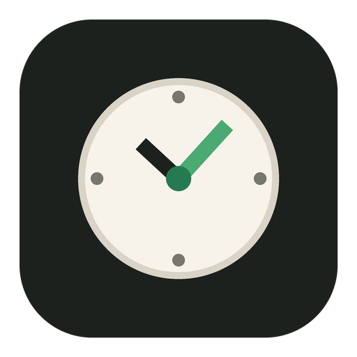

<div align="center">
  
  <h1>Foco</h1>
  <p>Um cronômetro minimalista para transformar intenção em tempo de foco.</p>
</div>

## Sobre

O Foco é um aplicativo para Windows que ajuda você a definir uma tarefa, reservar um período para ela e acompanhar quanto tempo realmente investiu no dia. Ele foi pensado para permanecer discreto na tela e não exige conta, internet ou configuração complexa.

## Funcionalidades

- Sessões predefinidas de 25, 30, 45 e 60 minutos.
- Duração personalizada de até 999 minutos.
- Descrição da intenção antes de começar cada sessão.
- Tags reutilizáveis para atividades recorrentes.
- Pausar, continuar e abandonar uma sessão.
- Contabilização incremental do tempo realmente focado.
- Total de hoje e de ontem.
- Relatório diário agrupado por atividade.
- Lista de tarefas integrada ao cronômetro, com tempo investido por tarefa.
- Categorias opcionais, edição e ações organizadas por tarefa.
- Resumo de hoje, ontem, semana atual e sequência de foco.
- Relógio flutuante redimensionável e sempre visível.
- Fundo ajustável de opaco a totalmente transparente.
- Temas claro e escuro.
- Alarme visual e sonoro contínuo ao finalizar.
- Recuperação da sessão após fechar ou reiniciar o aplicativo.

## Privacidade

Todos os dados ficam armazenados localmente no computador. O aplicativo não possui conta, telemetria, anúncios nem sincronização com servidores externos.

## Instalação

Baixe o instalador mais recente na seção **Releases** do GitHub e execute o arquivo `Foco Setup.exe`.

O instalador ainda não possui assinatura digital comercial. Por isso, o Windows pode apresentar um aviso de editor desconhecido.

## Desenvolvimento

Requisitos:

- Node.js 20 ou superior
- pnpm

```powershell
pnpm install
pnpm start
```

Executar os testes:

```powershell
pnpm test
```

Gerar o instalador para Windows:

```powershell
pnpm dist
```

O instalador será criado na pasta `dist`.

## Estrutura

```text
src/       processo principal e interfaces
tests/     testes da contabilização diária
build/     ícones do aplicativo
tools/     ferramentas de geração de recursos
```

## Licença

Distribuído sob a licença [MIT](LICENSE).
